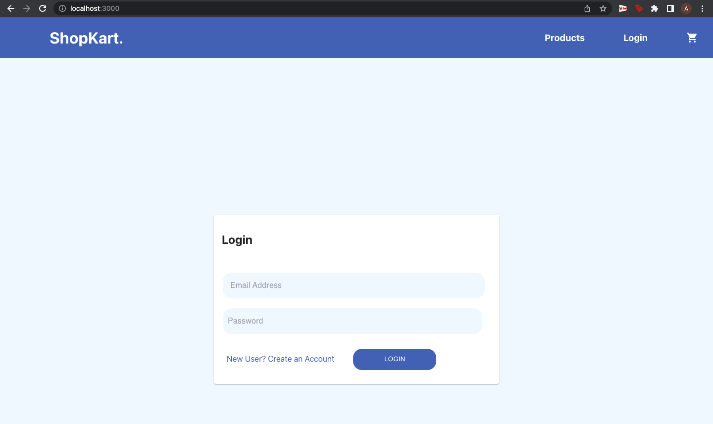
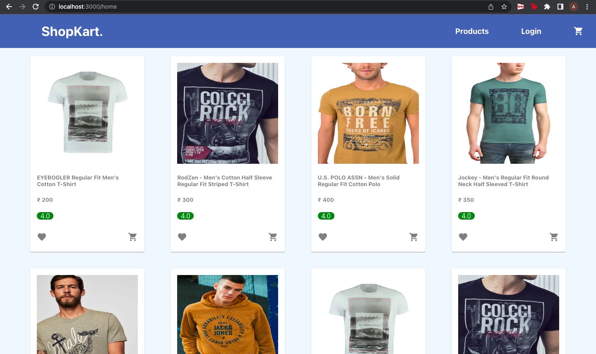
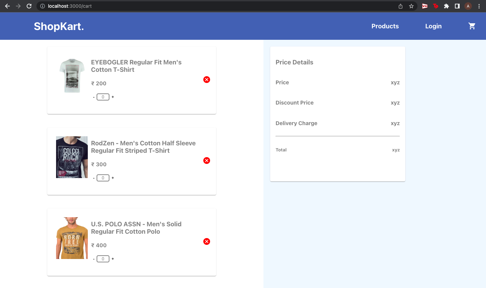

# Ecommerce (React) Coding Assessment

## Overview

To do this assessment, the [Ecommerce-boilerplate](https://github.com/gurukishore111/Ecommerce-boilerplate) web app was used

## Application Functionalities?

- Navigation Bar for easy access to all the pages
- Login Page where the User can login and move forward to the home page
- Home Page displays all the products available
- A pop up console opens up to show the product details
- A Shopping Card Page 

## Improvements

Currently the project has many bugs and issues which can be improved such as:
1. The product pop up console shows the information only for the last product listed
2. Products cannot be added to the shopping cart
3. The login Page and the shopping cart page have no functionality
4. Several buttons such as Favourite, Buy Now, Add to Cart, Create New Account, Place Order do not work

## What could have been different with more time

With more time, the bugs could have been fixed and smaller UI/UX issues such as alignment, text issues could have been worked on. A lot of pages don't have functionality and this could have been changed.

## Setup

- Clone this repo
- `npm install` - To install the dependencies
- `npm run server` - To start the JSON server
- `npm start` - To start the react app

## Screenshots of the project

### Login/Register page

### Home page

### Product detail page

### Cart page

## Conclusion

While this isn't the best work I've done, I enjoyed working on this project and am looking forward to any and all feedback! Thank You for the Opportunity

---
